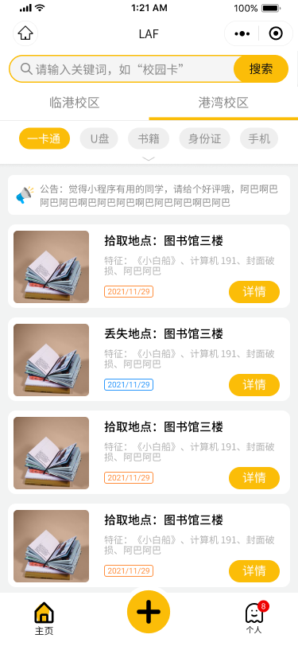
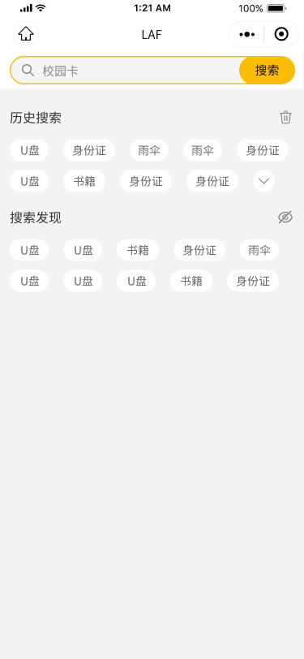
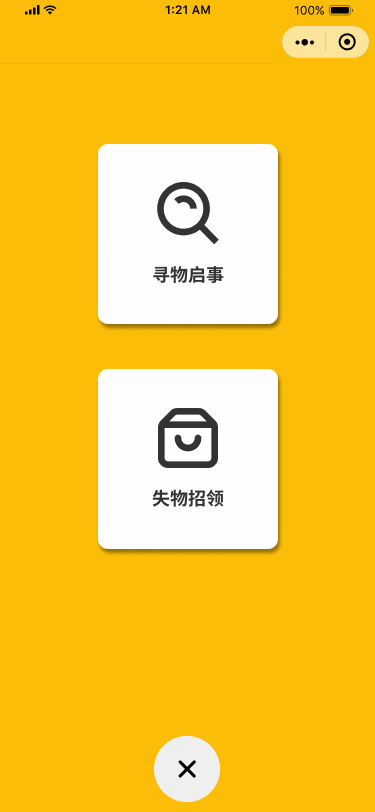
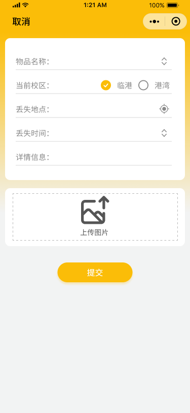
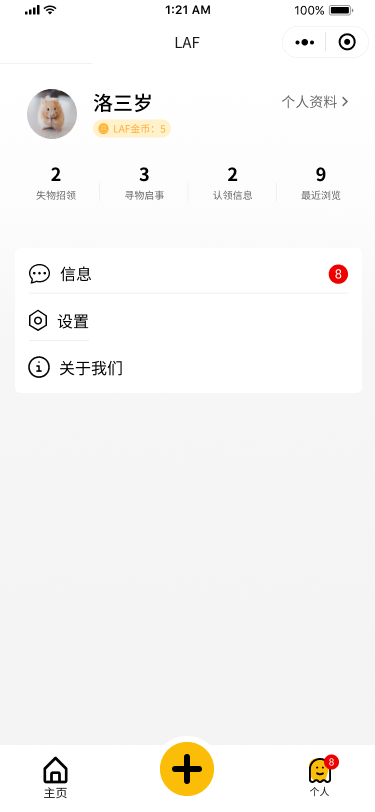
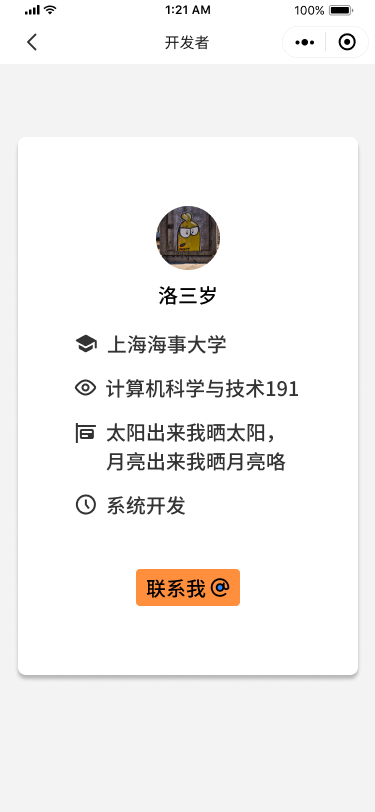

# 目录

[📦 原型设计](#原型设计)

[💽 数据库设计](#数据库设计)

[📚 路由设计](#路由设计)

[💾 本地存储](#本地存储)

[📑 页面设计](#页面设计)

[🔐 鉴权相关](#鉴权相关)

[💻 部署相关](#部署相关)

*注意: 微信小程序端需要配置一个正确的appid才能使用。此外由于实际需求变更，部分模块如: 留言、私聊等模块并未体现在此版本的代码中*

# 原型设计

### 设计稿

> 小程序设计原稿发布在Figma上,需要可[自取]

### 部分页面展示

# 数据库设计

### 学校信息表(schools)

> | 字段名 | 字段类型 | 可否为空 | 说明 |
> | :---- | :---- | :---- | :---- |
> | sid  | int(6),无符号,零填充,自动递增 | 否  | 主键,学校的唯一标识 |
> | name | char(32) | 否 | 学校名称 |
> | address | varchar(255) | 否 | 学校地址 |
> | phone | char(32) | 否 | 学校联系方式 |
> | createdAt | datetime | 否 | 学校注册时间,由Sequelize自动管理 |
> | updatedAt | datetime | 否 | 学校信息更新时间,由Sequelize自动管理 |

### 校区信息表(campuses)

> | 字段名 | 字段类型 | 可否为空 | 说明 |
> | :---- | :---- | :---- | :---- |
> | cid  | int(10),无符号,零填充,自动递增 | 否  | 主键,校区的唯一标识 |
> | name | char(32) | 否 | 校区名称 |
> | location | json | 否 | 学校地址的经纬度,用于确定用户选择拾取地点时的初始位置,格式:{"latitude": "30", "longitude": "121"} |
> | tip | json | 否 | 该校区指定的用户可选择发布的物品条目,格式:["手机", "电脑"] |
> | notice | varchar(255) | 是 | 该校区发布的公告 |
> | createdAt | datetime | 否 | 校区注册时间,由Sequelize自动管理 |
> | updatedAt | datetime | 否 | 校区信息更新时间,由Sequelize自动管理 |
> | schoolSid | int(6) | 否 | 校区所属学校id |

### 用户信息表(users)

> | 字段名 | 字段类型 | 可否为空 | 说明 |
> | :---- | :---- | :---- | :---- |
> | uid | char(64) | 否 | 主键,由微信小程序中该用户的openid与其所属学校的sid共同组成(一个openid可与不同的学校sid组合,即一个用户可注册多个学校),唯一标识 |
> | name  | char(16) | 否 | 用户微信名 |
> | image | varchar(255) | 否 | 用户微信头像 |
> | coin | int(10) | 否  | 用户发布的物品被管理员确认认领后给予的积分奖励 |
> | createdAt | datetime | 否 | 用户注册时间,由Sequelize自动管理 |
> | updatedAt | datetime | 否 | 用户信息更新时间,由Sequelize自动管理 |
> | campusCid | int(10) | 否 | 用户所属校区id |

### 物品可放置地点表(places)

> | 字段名 | 字段类型 | 可否为空 | 说明 |
> | :---- | :---- | :---- | :---- |
> | pid | int(10),无符号,零填充,自动递增 | 否 | 主键,可放置地点id,唯一标识 |
> | name  | char(16) | 否 | 地点名称 |
> | location | json | 否 | 可放置地点的经纬度,用于为寻物者导航,格式:{"latitude": "30", "longitude": "121"} |
> | createdAt | datetime | 否 | 地点注册时间,由Sequelize自动管理 |
> | updatedAt | datetime | 否 | 地点信息更新时间,由Sequelize自动管理 |
> | campusCid | int(10) | 否 | 地点所属校区id |

### 物品信息表

> | 字段名 | 字段类型 | 可否为空 | 说明 |
> | :---- | :---- | :---- | :---- |
> | oid | bigint(20),无符号,零填充,自动递增 | 否 | 主键,物品id,唯一标识 |
> | name  | char(32) | 否 | 物品名称 |
> | address | json | 否 | 拾取物品的地点的经纬度,由小程序接口自动获取,格式:{"name": "海大图书馆", "address": "海大校内", "latitude": 30, "longitude": 121} |
> | time | date | 否 | 用户拾取物品的日期 |
> | describe | json | 是 | 物品相关描述,选填项目 |
> | image | json | 是 | 物品相关图片,选填,最多三张,由程序自动管理,空值会被设为"\[\]",格式:\["/image/日期/图片名称"\] |
> | createdAt | datetime | 否 | 物品信息上传时间,由Sequelize自动管理 |
> | updatedAt | datetime | 否 | 物品信息更新时间,由Sequelize自动管理 |
> | userUid | char(64) | 否 | 发布该条目的用户id |
> | placePid | int(10) | 否 | 该物品放置的放置地点id |
> | claim | char(64) | 是 | 认领物品的用户id,字段为空则无人认领,按需求应由管理员填写确认 |

## 图片索引表(images)

> | 字段名 | 字段类型 | 可否为空 | 说明 |
> | :---- | :---- | :---- | :---- |
> | hash | char(128) | 否 | 主键,图片hash,唯一标识 |
> | src | varchar(255) | 否 | 图片相对地址 |
> | type | char(64) | 否 | 图像MIME类型 |
> | createdAt | datetime | 否 | 图片上传时间,由Sequelize自动管理 |
> | updatedAt | datetime | 否 | 图片信息更新时间,由Sequelize自动管理 |

## 用户浏览足迹表(footmarks)

> | 字段名 | 字段类型 | 可否为空 | 说明 |
> | :---- | :---- | :---- | :---- |
> | userUid | char(64) | 否 | 主键,用户id,与objectOid共同确认一条记录 |
> | objectOid | bigint(20) | 否 | 主键,物品id,与userUid共同确认一条记录 |
> | createdAt | datetime | 否 | 用户浏览物品的时间,由Sequelize自动管理 |
> | updatedAt | datetime | 否 | 相关信息更改时间,由Sequelize自动管理 |

## 用户搜索表(searches)

> | 字段名 | 字段类型 | 可否为空 | 说明 |
> | :---- | :---- | :---- | :---- |
> | tid | int(10),无符号,零填充,自动递增 | 否 | 主键,关键词id |
> | name | char(32) | 否 | 关键词名称 |
> | count | bigint(20) | 否 | 关键词搜索次数 |
> | createdAt | datetime | 否 | 关键词第一次被搜索的时间,由Sequelize自动管理 |
> | updatedAt | datetime | 否 | 关键词信息更新的时间,由Sequelize自动管理 |
> | sid  | int(6) | 否  | 标签所属学校id |

# 路由设计

> | id | 请求地址 | 请求方法 | 头部是否携带JWT | 携带数据描述 | 返回值描述 | 请求页面 |
> | :---- | :---- | :---- | :---- | :---- | :---- | :---- |
> | 1 | /api/user/session/login  | POST | 否 | 临时code,学校sid,校区cid(仅注册时存在),用户头像昵称(仅注册时存在) | JWT,用户信息 | login.submit |
> | 2 | /api/user/info/school  | POST | 否 | 微信小程序临时code | 学校,校区,该校下是否存在该用户 | login.onload |
> | 3 | /api/user/info/index/tip | POST | 是 | 无 | 各个校区名称,公告,标签,及对应的10条物品数据(数据要经过handleList函数处理) | index.onload / list.searchKeyWord |
> | 4 | /api/user/info/index/list | POST | 是 | 校区cid,当前页最小的物品oid | 物品相关信息,如oid,图片,描述等 | index.goBtm / list.goBtm |
> | 5 | /api/user/info/user-count | GET | 是 | 无 | 相关物品数量 | user.onload |
> | 6 | /api/user/info/user-object | POST | 是 | 点击图标的索引 | 返回对应物品的详情信息 | user.goList |
> | 7 | /api/user/info/search-tip | GET | 是 | 无 | 返回搜索数较高的几条热搜 | search.onload |
> | 8 | /api/user/info/details-info | POST | 是 | 物品oid,是否获取物品详情信息的flag(页面可能直接接受参数进行渲染不需要请求物品信息) | 返回发布者信息,当请求的flag为true时获取物品详情信息 | details.onload |
> | 9 | /api/user/info/submit-list | GET | 是 | 无 | 用户可选发布物品列表 | submit.onload |
> | 10 | /api/serve/img/upload | POST | 是 | 图片 | 图片相对地址 | submit.submitInfo |
> | 11 | /api/user/operate/submit-object-info | POST | 是 | 拾取物品的地点,图片,描述,时间等 | ok | submit.submitInfo |

# 本地存储

> | 路由id | key | data |
> | :---- | :---- | :---- |
> | 2 | jwt | string |
> | 2 | info |  user:{ coin,id,iamge,name } |

# 页面设计

> | 页面 | 说明 |
> | :---- | :---- |
> | about | 关于页面 |
> | agreement | 用户协议页面 |
> | details | 物品详情页 |
> | developer | 开发者页面 |
> | index | 首页 |
> | list | 搜索页和用户页跳转到的物品列表页 |
> | login | 登录注册页 |
> | message | 信息列表页,原与私聊相关,应最新需求去除私聊后,本页面暂时保留 |
> | search | 搜索页 |
> | session | 私聊对话页,原与私聊相关,应新需求去除,暂时保留 |
> | setting | 设置页,需求不明确,故仅实现退出登录 |
> | space | 底部栏中间按钮占位页面,无用,但需保留 |
> | submit | 信息提交页 |
> | user | 用户个人中心 |
> | custom-tab-bar | 非页面,底部Bar组件,用于主页和用户个人中心页面 |

# 鉴权相关

> 微信小程序会获取用户的一个临时code(5分钟有效)，并将code发送到后端，后端根据配置文件里的信息请求`https://api.weixin.qq.com/sns/jscode2session`换取用户的openid,将该openid视为可信数据,以此为依据发放JWT

# 部署相关

> + 微信小程序
>    1. 在`app.js`中`globalData`下配置服务器域名和图片上传接口
>    2. 按照一般微信小程序部署步骤部署
> + 后端
>    1. 数据库相关配置在`config`目录下,手动创建数据库
>    2. 将`/utils/mountModel.js`下`同步模型`部分解除注释,直接运行程序建立数据库相关表(也可执行sql文件创建)
>    3. 手动填入学校,校区,放置地点等信息
>    4. 在微信公众平台注册用户,并在`config`目录的文件中配置相关的`appid`和`secret`
>    5. 运行程序,可使用NGINX进行反代

[自取]: https://www.figma.com/community/file/1125376984135152418